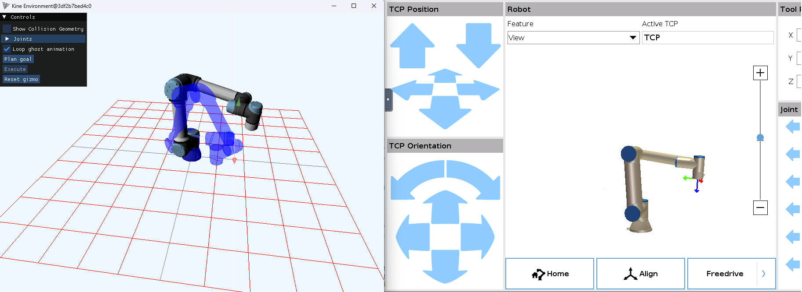
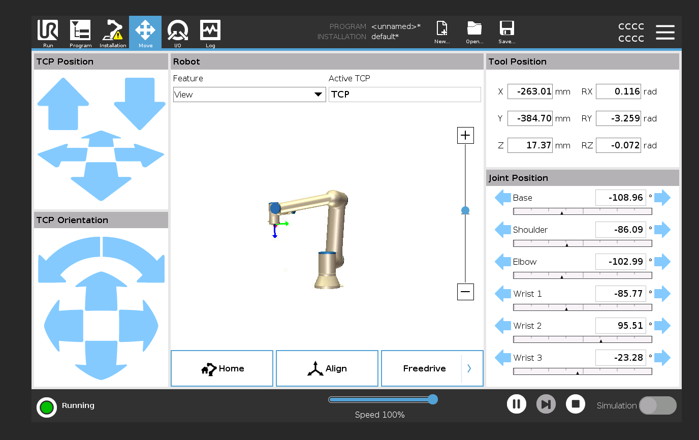
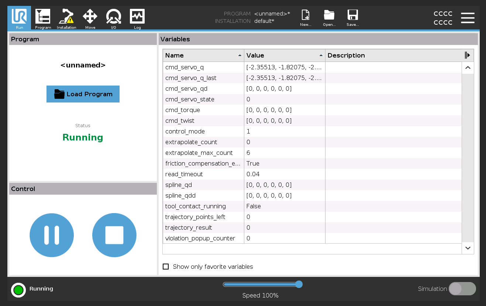

# AIS2105 - Øving 5 - MoveIt og UR-roboter

## Innledning

I denne øvingen skal dere bli kjent med **MoveIt 2** — et rammeverk for bevegelsesplanlegging i ROS 2 — 
og **Universal Robots (UR)**-simulatorer. 
Dere vil bruke et ferdig workspace med flere pakker som sammen lar dere visualisere, 
planlegge og kjøre trajektorier på en UR5e-robot.

>Ved feil i øvingen, kontakt Lars Ivar.

### Arbeidsform

Øvingen gjøres i **par**. Dere jobber sammen gjennom alle delene — diskuter, hjelp hverandre og del skjermen når én skriver.
Begge skal forstå det som leveres inn.

---


Øvingen er delt i tre deler:

- **Del A**: Simulert kontroller og Kine-visualisering (uten Docker)
- **Del B**: URSim med Docker — koble MoveIt til en simulert UR-robot
- **Del C**: Skriv en egen trajectory-node i Python

### Forutsetninger

- Du har gjennomført øving 1–4 og har grunnleggende kjennskap til ROS 2 (topics, services, launch-filer)
- Du har et fungerende ROS 2-miljø (RoboStack på Windows (se [ROBOSTACK.md](doc/ROBOSTACK.md)) eller native ROS 2 Jazzy på Linux)
- Docker Desktop er installert (for Del B)

### Pakker i workspace-et

| Pakke | Beskrivelse |
|---|---|
| `ur_bringup` | Launch-filer for alle scenariene |
| `kine` | 3D-visualisering med interaktiv gizmo-kontroll |
| `target_planner` | MoveIt-basert planlegger med Plan/Execute/PlanAndExecute actions |
| `simulated_controller` | Simulert joint-kontroller (erstatter ekte robot-driver) |
| `joint_commander` | Python-noder som sender trajektorier via actions |

---

## Del A — Simulert kontroller og Kine-visualisering

I denne delen kjører du alt lokalt uten Docker. En simulert kontroller erstatter den ekte robot-driveren.

### A1: Bygg workspace

Åpne en terminal i roten av workspace-et og bygg:

**Windows (RoboStack):**
```bash
colcon build --merge-install --base-paths src --cmake-args -G Ninja -DCMAKE_BUILD_TYPE=Release
```

**Linux:**
```bash
colcon build --symlink-install --base-paths src --cmake-args -DCMAKE_BUILD_TYPE=Release
```

Source install-scriptet etterpå:

**Windows (RoboStack):**
```bash
install/local_setup.ps1 # For PowerShell
install/local_setup.bat # For Command Prompt
```

**Linux:**
```bash
source install/local_setup.bash
```

> **Tips:** Du må source install-scriptet i hver ny terminal du åpner.

---

### A2: URDF-visualisering

Start URDF-visualisering med Kine (med eller uten RViz):

```bash
ros2 launch ur_bringup display_robot.launch.py launch_rviz:=false
```

Dette starter:
- `robot_state_publisher` — publiserer robotens URDF-modell
- `kine_environment` — 3D-visualisering

**Utforsk Kine-vinduet:**
1. Roter kameraet med musen (venstre museknapp + dra)
2. Åpne **Joints**-panelet i Kine
3. Dra sliderne for å bevege robotens ledd

**CLI-oppgaver** (i en ny terminal, husk å source):

```bash
ros2 topic list
```

```bash
ros2 topic echo /joint_states --once
```

> **Spørsmål:** Hvilke topics publiseres? Hva inneholder `JointState`-meldingen (hvilke felter, og hva representerer de)?

---

### A3: MoveIt-planlegging med simulert kontroller

Stopp forrige launch (Ctrl+C) og start MoveIt-oppsettet:

```bash
ros2 launch ur_bringup move_robot.launch.py launch_rviz:=false
```

Dette starter fire komponenter:
- **move_group** — MoveIt sin planlegger-server
- **target_planner** — mellomlag som eksponerer Plan/Execute/PlanAndExecute actions
- **simulated_controller** — simulert joint-kontroller med `FollowJointTrajectory` action-server
- **kine_environment** — 3D-visualisering med gizmo-kontroll

**Gizmo-kontroll i Kine:**

| Tast | Funksjon |
|------|----------|
| **Q** | Bytt mellom lokal og global ramme |
| **W** | Translasjon (flytt gizmoen) |
| **E** | Rotasjon (roter gizmoen) |

**Oppgaver:**

1. Flytt gizmoen til en ny posisjon (W + dra)
2. Klikk **Plan** — observer den oransje ghost-animasjonen som viser planlagt trajektorie
3. Klikk **Execute** — observer at roboten beveger seg til mål-posisjonen
4. Flytt gizmoen til en annen posisjon og prøv **Plan & Execute** (planlegger og kjører i ett steg)
5. Start en ny Plan & Execute og trykk **Cancel** under utførelse — observer at roboten stopper



**Kjør med RViz:**

Start på nytt med RViz aktivert:

```bash
ros2 launch ur_bringup move_robot.launch.py launch_rviz:=true
```

I RViz kan dere bruke **MotionPlanning**-panelet til å planlegge og kjøre trajektorier via MoveIt sitt eget grensesnitt:
1. Dra den interaktive markøren til en ny posisjon
2. Klikk **Plan** og deretter **Execute**
3. Observer den grønne ghost-roboten som viser planlagt sluttposisjon og den oransje som viser trajektorien

> **Spørsmål:** Sammenlign Kine og RViz som grensesnitt for MoveIt.
> Hva kan du gjøre i RViz som ikke er mulig i Kine? Hva synes dere er enklere eller mer intuitivt i Kine?

---

### A4: Utforsk ROS 2 actions

Actions er asynkrone operasjoner med feedback underveis — perfekt for bevegelsesplanlegging som tar tid.

**List alle action-servere:**

```bash
ros2 action list
```

Du skal se tre actions fra `target_planner`:
- `/plan` — planlegger en trajektorie til mål-pose
- `/execute` — kjører sist planlagte trajektorie
- `/plan_and_execute` — planlegger og kjører i ett steg

**Inspiser en action:**

```bash
ros2 action info /plan --show-types
```

> **Spørsmål:** Hva er forskjellen mellom topics, services og actions? Når er actions mer hensiktsmessig enn services?

**Send en action fra kommandolinja:**

Flytt gizmoen til ønsket posisjon i Kine og les av posisjonen. Deretter kan du sende en `plan_and_execute`-action direkte:

```bash
ros2 action send_goal /plan_and_execute target_planner/action/PlanAndExecute \
  "{target_pose: {header: {frame_id: 'base_link'}, pose: {position: {x: 0.4, y: 0.3, z: 0.5}, orientation: {x: 0.0, y: 0.707, z: 0.0, w: 0.707}}}}" \
  --feedback
```

Observer feedback-meldingene som viser hvilken fase (planning/executing) operasjonen er i.

---

### A5: Juster planner-parametere

Target planner har flere parametere du kan justere i sanntid.

**Via Kine UI:**
1. Åpne **Planner Settings**-panelet i Kine
2. Sett velocity scaling til **0.1**
3. Planlegg og kjør — observer tregere bevegelse

**Via CLI:**

```bash
ros2 param set /target_planner max_velocity_scaling_factor 0.5
```

**Prøv en ugyldig verdi:**

```bash
ros2 param set /target_planner planning_time -1
```

> **Spørsmål:** Hva skjer når du setter en ugyldig verdi? Hvorfor er det nyttig at noden avviser ugyldige parametere?

---

### A6: Kjør action_commander

`action_commander` er en ferdig Python-node som sender forhåndsdefinerte waypoints via `FollowJointTrajectory`-action.

Start den (med simulert kontroller):

```bash
ros2 launch ur_bringup action_commander.launch.py
```

Observer at roboten følger en sekvens av waypoints.

**Se på kildekoden:**

Åpne `src/joint_commander/joint_commander/action_commander.py` og studer:
- Hvordan `WAYPOINTS` er definert (posisjoner i radianer + tid)
- Hvordan `ActionClient` kobler til `FollowJointTrajectory`-serveren
- Hvordan feedback logges underveis

> Denne koden blir referanse for Del C.

**Send en trajektorie direkte fra CLI:**

Du kan sende `FollowJointTrajectory`-goals uten å skrive en node — nyttig for rask testing.
Inspiser action-typen først:

```bash
ros2 action info /simulated_joint_controller/follow_joint_trajectory --show-types
```

Send ett waypoint (robotens hjemposisjon, nås på 3 sekunder):

```bash
ros2 action send_goal /simulated_joint_controller/follow_joint_trajectory \
  control_msgs/action/FollowJointTrajectory \
  "{trajectory: {
      joint_names: [shoulder_pan_joint, shoulder_lift_joint, elbow_joint,
                    wrist_1_joint, wrist_2_joint, wrist_3_joint],
      points: [{
          positions: [0.0, -1.5708, 0.0, -1.5708, 0.0, 0.0],
          time_from_start: {sec: 3, nanosec: 0}
      }]
  }}" \
  --feedback
```

Send en fler-punkts trajektorie (tre waypoints):

```bash
ros2 action send_goal /simulated_joint_controller/follow_joint_trajectory \
  control_msgs/action/FollowJointTrajectory \
  "{trajectory: {
      joint_names: [shoulder_pan_joint, shoulder_lift_joint, elbow_joint,
                    wrist_1_joint, wrist_2_joint, wrist_3_joint],
      points: [
          {positions: [0.0,    -1.5708, 0.0, -1.5708, 0.0, 0.0], time_from_start: {sec: 3, nanosec: 0}},
          {positions: [0.7854, -1.5708, 0.5, -1.5708, 0.0, 0.0], time_from_start: {sec: 6, nanosec: 0}},
          {positions: [0.0,    -1.5708, 0.0, -1.5708, 0.0, 0.0], time_from_start: {sec: 9, nanosec: 0}}
      ]
  }}" \
  --feedback
```

> **Merk:** Posisjoner er i radianer. `0.7854 ≈ π/4` og `1.5708 ≈ π/2`.
> `time_from_start` er tid siden trajektorien startet — ikke tid mellom punktene.

> **Spørsmål:** Hva skjer hvis du setter `time_from_start` for to punkter til samme verdi?
> Hva skjer hvis du sender et punkt med `time_from_start: {sec: 0, nanosec: 0}` som første punkt?

---

## Del B — URSim med Docker

I denne delen kjører du en simulert UR-robot (URSim) i Docker og kobler MoveIt til den via `ur_robot_driver`.

> NB! På Windows må du innstallere [vcxsrv](https://github.com/marchaesen/vcxsrv/releases) 
og starte XLaunch for å kunne starte GUI applikasjoner inne i Docker.

### B1: Bygg Docker-images

Først må du bygge base-imaget som de andre er avhengige av:

```bash
cd docker_files
docker build -t ros_ur_base:latest -f Dockerfile.base .
cd ..
```

Start deretter alle containerne:

**Windows:**
```bash
docker compose up --build
```

**Linux:**
```bash
xhost +local:docker
docker compose -f docker-compose.yml -f docker-compose.linux.yml up --build
```

Vent til alle tre containerne kjører (`ursim`, `ur_driver`, `ros2_dev`).

---

### B2: Konfigurer URSim

1. Åpne nettleseren og gå til `http://localhost:6080`
2. Du ser URSim sitt brukergrensesnitt

**Power on roboten:**
- Klikk på den røde knappen nederst til venstre → **ON** → **START**



**Konfigurer External Control:**
1. Gå til **Installation** → **URCaps** → **External Control**
2. Sett **Host IP** til `172.20.0.3` (IP-adressen til `ur_driver`-containeren)



**Start External Control-programmet:**
1. Gå til **Program**
2. Legg til **URCaps** → **External Control** i programmet
3. Trykk **Play** (▶) nederst

Når programmet kjører, kobler URSim seg til `ur_driver`-containeren, og joint states blir tilgjengelig via ROS 2.

---

### B3: Koble til dev-containeren

Åpne en ny terminal og koble til `ros2_dev`-containeren:

```bash
docker exec -it ursim-ros2_dev-1 bash
```

Verifiser at joint states mottas fra URSim:

```bash
ros2 topic echo /joint_states --once
```

Du skal se reelle joint-posisjoner fra den simulerte roboten.

**Bygg workspace inne i containeren:**

```bash
cd /ros2_ws
colcon build --merge-install --base-paths src --cmake-args -DCMAKE_BUILD_TYPE=Release
source install/local_setup.bash
```

---

### B4: Kjør MoveIt mot URSim

Inne i dev-containeren, start MoveIt uten simulert kontroller:

```bash
ros2 launch ur_bringup move_robot.launch.py sim_controller:=false launch_rviz:=false
```

Nå bruker MoveIt `scaled_joint_trajectory_controller` fra `ur_robot_driver` i stedet for den simulerte kontrolleren.

**Oppgaver:**
1. Bruk gizmo-kontrollen i Kine til å planlegge og kjøre trajektorier
2. Observer at URSim-roboten (i nettleseren) beveger seg
3. Sammenlign med Del A: legg merke til at bevegelsen ser mer realistisk ut

---

### B5: Action commander mot URSim

Inne i dev-containeren:

```bash
ros2 launch ur_bringup action_commander.launch.py sim_controller:=false
```

Observer at waypoints kjøres på URSim-roboten i nettleseren.

---

## Del C — Lag en egen ROS 2-pakke med planner-node

Du skal nå opprette en egen ROS 2 Python-pakke og skrive en node som bruker `PlanAndExecute`-actionen fra `target_planner` til å sende roboten til en sekvens av kartesiske mål-poser (posisjon + orientering).

### C1: Opprett pakken

Naviger til `src/`-mappen og bruk `ros2 pkg create`:

```bash
cd src
ros2 pkg create my_planner --build-type ament_python --dependencies rclpy geometry_msgs target_planner
```

Dette oppretter følgende struktur:

```
src/my_planner/
├── my_planner/
│   └── __init__.py
├── package.xml
├── setup.cfg
├── setup.py
└── resource/
    └── my_planner
```

### C2: Skriv noden

Opprett filen `src/my_planner/my_planner/planner_node.py` og fyll inn `TODO`-kommentarene:

```python
"""
Min egen planner-node.
Sender en sekvens av kartesiske mål-poser til PlanAndExecute action-serveren.
"""

import rclpy
from rclpy.node import Node
from rclpy.action import ActionClient
from geometry_msgs.msg import PoseStamped
from target_planner.action import PlanAndExecute


# TODO: Definer minst 3 egne mål-poser.
# Hver pose er en dict med position (x, y, z) og orientation (x, y, z, w) som quaternion.
# Tips: Bruk Kine til å finne gyldige poser — flytt gizmoen og les av verdiene.
# Orientering (0, 0.707, 0, 0.707) peker verktøyet nedover (vanlig for UR5e).
TARGETS = [
    # TODO: Fyll inn dine mål-poser her
    # Eksempel:
    # {"position": (0.4, 0.3, 0.5), "orientation": (0.0, 0.707, 0.0, 0.707)},
]


class MyPlannerNode(Node):
    def __init__(self):
        super().__init__('my_planner_node')
        self._client = ActionClient(self, PlanAndExecute, '/plan_and_execute')

        self.get_logger().info('Venter på /plan_and_execute action-server...')
        self._client.wait_for_server()
        self.get_logger().info('Action-server klar!')

        self._current_target = 0
        self._send_next_target()

    def _send_next_target(self):
        if self._current_target >= len(TARGETS):
            self.get_logger().info('Alle mål-poser er nådd!')
            return

        target = TARGETS[self._current_target]
        self.get_logger().info(
            f'Sender mål-pose {self._current_target + 1}/{len(TARGETS)}: '
            f'pos=({target["position"][0]}, {target["position"][1]}, {target["position"][2]})'
        )

        # TODO: Opprett en PlanAndExecute.Goal med en PoseStamped.
        # Sett header.frame_id til 'base_link'.
        # Sett pose.position og pose.orientation fra target-dicten.
        goal = PlanAndExecute.Goal()
        goal.target_pose = PoseStamped()
        # ...

        # TODO: Send goal asynkront med feedback-callback.
        # Legg til done-callback for å håndtere respons fra serveren.
        pass

    def _on_goal_response(self, future):
        handle = future.result()
        if not handle.accepted:
            self.get_logger().error('Goal avvist!')
            return
        self.get_logger().info('Goal akseptert — planlegger og kjører...')
        handle.get_result_async().add_done_callback(self._on_result)

    def _on_feedback(self, feedback):
        # TODO: Logg feedback.feedback.phase (viser "planning" eller "executing").
        pass

    def _on_result(self, future):
        result = future.result().result

        # TODO: Sjekk result.success og logg result.message.
        # Hvis vellykket: inkrementer self._current_target og kall self._send_next_target().
        pass


def main(args=None):
    rclpy.init(args=args)
    node = MyPlannerNode()
    try:
        rclpy.spin(node)
    except KeyboardInterrupt:
        pass
    finally:
        node.destroy_node()
        rclpy.shutdown()
```

### C3: Registrer noden som executable

Åpne `src/my_planner/setup.py` og legg til en entry point under `console_scripts`:

```python
entry_points={
    'console_scripts': [
        'planner_node = my_planner.planner_node:main',
    ],
},
```

### C4: Bygg og kjør

Bygg pakken fra workspace-roten:

**Windows (RoboStack):**
```bash
colcon build --merge-install --base-paths src --packages-select my_planner --cmake-args -G Ninja
```

**Linux:**
```bash
colcon build --symlink-install --base-paths src --packages-select my_planner
```

Source på nytt og kjør:

```bash
# Source install-scriptet (se A1 for riktig kommando for ditt OS)
```

Start MoveIt-stacken i en terminal:
```bash
ros2 launch ur_bringup move_robot.launch.py launch_rviz:=false
```

Kjør din node i en annen terminal:
```bash
ros2 run my_planner planner_node
```

Observer i Kine at roboten planlegger og beveger seg til hver mål-pose i sekvens.

**Mot URSim** (valgfritt):

Kjør noden inne i dev-containeren med MoveIt startet mot URSim (`sim_controller:=false`).

---

## Innleveringskrav

Lever følgende:

1. **Skjermbilde** av Kine med en planlagt trajektorie (Del A — den oransje ghost-animasjonen)
2. **Skjermbilde** av URSim under utførelse av en bevegelse (Del B)
3. **Python-kildekode** for deres egen trajectory-node (Del C)
4. **Refleksjon A/B** (3–5 setninger): Hva er forskjellen mellom å kjøre med simulert kontroller (Del A) og URSim (Del B)? Tenk på hastighet, realisme og oppførsel.
5. **Læringsrefleksjon** (4–6 setninger): Hva var nytt eller overraskende for deg i denne øvingen? Hva synes du var vanskelig, og hva hjalp deg videre? Hva tar du med deg til neste øving?
